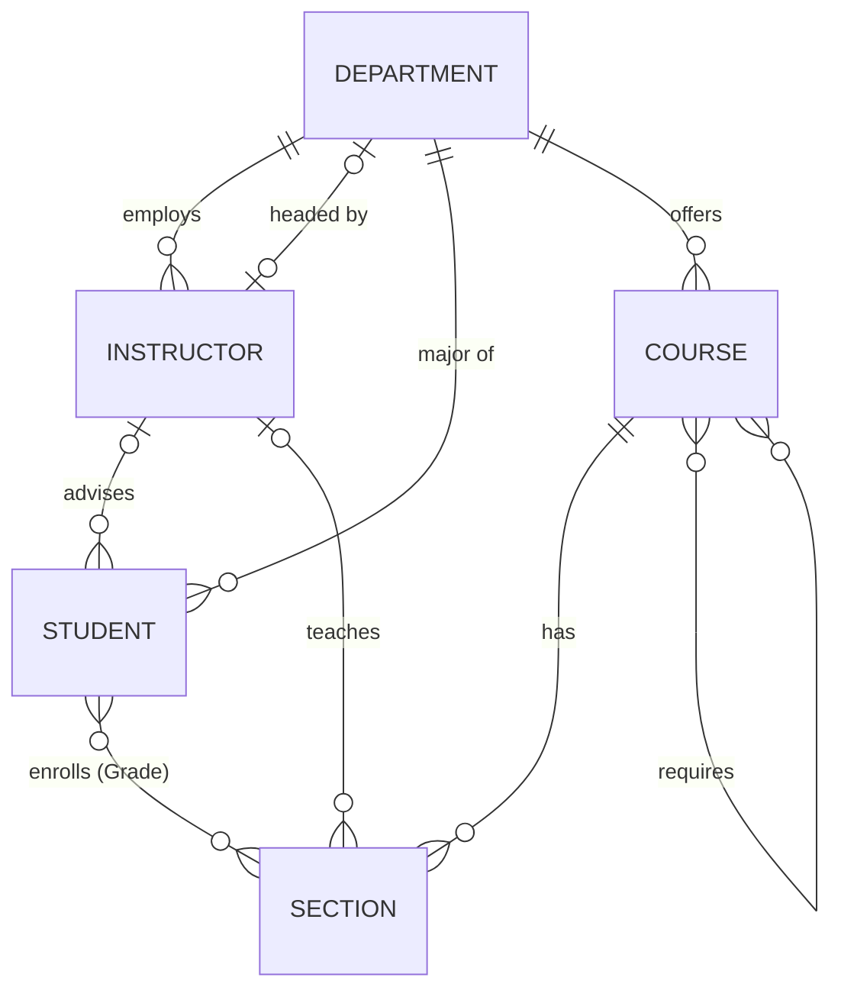

# Chapter 2 – The Entity–Relationship Model

**Learning outcomes:** CLO2

After studying this chapter, you should be able to:

- identify the entities, attributes, and relationships in a set of requirements;
- choose correct key attributes, cardinality ratios, and participation constraints;
- model weak entities and relationship attributes;
- draw an ER diagram in Chen notation and in crow's-foot notation.

**Readings:** [DSC] Ch. 6 (6.1–6.8); [DMS] Ch. 2

---

## 2.1 The database design process

1. **Requirements collection and analysis:** interview users and write down the data requirements.
2. **Conceptual design:** build a high-level model, usually an ER diagram, that is independent of any DBMS.
3. **Logical design:** map the conceptual model to a data model such as the relational model (Chapter 3).
4. **Physical design:** choose indexes, file organizations, and partitioning.

## 2.2 Entities and attributes

- An **entity** is a "thing" in the real world that exists independently, e.g. a particular student or a particular course.
- An **entity type** is a set of entities that have the same attributes, e.g. `STUDENT`. In Chen notation it is drawn as a **rectangle**.
- An **attribute** is a property that describes an entity. It is drawn as an **oval**.

### Kinds of attributes

| Kind | Meaning | Example | Chen notation |
|---|---|---|---|
| Simple (atomic) | Cannot be divided | `Gender` | Oval |
| Composite | Made of smaller parts | `Name` = (`FirstName`, `LastName`) | Oval connected to its component ovals |
| Single-valued | One value per entity | `DateOfBirth` | Oval |
| Multivalued | Can have several values | `PhoneNumbers` | **Double** oval |
| Stored | Stored in the database | `DateOfBirth` | Oval |
| Derived | Can be computed from other data | `Age` (from `DateOfBirth`) | **Dashed** oval |
| Key | Uniquely identifies each entity | `StudentID` | **Underlined** name |

A `NULL` value is used when a value does not apply (a person without a middle name) or is unknown.

### Key attributes

A **key** is an attribute, or a set of attributes, whose values are different for every entity of the type. An entity type may have several keys. For example, `STUDENT` has both `StudentID` and `Email`.

## 2.3 Relationships

- A **relationship** is an association between entities, e.g. *Student An is enrolled in section 5*.
- A **relationship type** is a set of similar relationships. It is drawn as a **diamond**.
- The **degree** of a relationship type is the number of entity types that participate in it: unary (recursive), binary, or ternary.

### Cardinality ratio (for binary relationships)

| Ratio | Meaning | Example |
|---|---|---|
| 1:1 | Each A relates to at most one B, and each B to at most one A | `DEPARTMENT` — *headed by* — `INSTRUCTOR` |
| 1:N | Each A relates to many Bs, and each B to at most one A | `DEPARTMENT` — *employs* — `INSTRUCTOR` |
| M:N | Each A relates to many Bs, and each B to many As | `STUDENT` — *enrolls in* — `SECTION` |

### Participation constraint

- **Total participation** (existence dependency): every entity must take part in the relationship. It is drawn with a **double line**. Example: every instructor *must* belong to a department.
- **Partial participation:** some entities may not take part. It is drawn with a single line. Example: not every instructor *is the head* of a department.

### (min, max) notation

Instead of a ratio and a participation constraint, each participation can be labeled `(min, max)`. Here `min = 0` means partial, `min ≥ 1` means total, and `max` is the largest number of relationships an entity can take part in. For example, `INSTRUCTOR (1,1)` — *works for* — `(0,N) DEPARTMENT`.

> **Warning:** in (min, max) notation the label is placed next to the entity it describes. This is the *opposite* side from where the "1" and "N" of a cardinality ratio are placed. State which notation you are using.

### Relationship attributes

A relationship can have attributes of its own. `Grade` belongs to the *enrolls in* relationship, not to `STUDENT` and not to `SECTION`, because it depends on both of them.

- For 1:1 or 1:N relationships, a relationship attribute can be moved to the entity on the N side, or to either side of a 1:1 relationship.
- For M:N relationships, the attribute must stay on the relationship.

### Recursive relationships and role names

When the same entity type takes part more than once, **role names** tell the participations apart. Example: `COURSE` — *requires* — `COURSE`, with the roles *course* and *prerequisite*.

## 2.4 Weak entity types

A **weak entity type** has no key of its own. Its entities are identified by being related to an entity of an **owner** (identifying) entity type, combined with a **partial key**.

- It is drawn as a **double rectangle**. The identifying relationship is a **double diamond**, and the partial key is underlined with a **dashed** line.
- A weak entity always has **total participation** in its identifying relationship.
- Example: `DEPENDENT` (partial key `DependentName`), owned by `EMPLOYEE`. Another example: `SECTION` identified by (`COURSE`, `Semester`, `SectionNo`).

## 2.5 Design guidelines and choices

- **Attribute or entity?** If a concept has attributes of its own or takes part in relationships, make it an entity. For example, `Department` should be an entity, not a text attribute of `Student`.
- **Entity or relationship?** Use a relationship for an action or association between entities, and give it attributes if needed.
- **Binary or ternary?** A ternary relationship is not always equivalent to three binary relationships. Use a ternary relationship only when a fact truly involves all three entities at once, e.g. *Supplier S supplies part P to project J*.
- Avoid redundant relationships that can be derived from others.
- Name entity types with singular nouns and relationships with verbs.

## 2.6 Worked example: UniversityDB requirements

> The university has **departments**, each with a unique ID, a name, a building, and a budget. Each **instructor** has an ID, a name, an email, a salary, and a hire date, and works for exactly one department. A department has at most one head, who is an instructor. A **student** has an ID, a name, a gender, a date of birth, and an email. Each student majors in exactly one department and may have one instructor as an advisor. A **course** has an ID, a title, and a number of credits, and is offered by one department. A course may have other courses as prerequisites. A course is taught in one or more **sections** per semester. Each section has a room and a capacity and is taught by at most one instructor. Students **enroll** in sections and receive a grade.

**Entity types:** `DEPARTMENT`, `INSTRUCTOR`, `STUDENT`, `COURSE`, `SECTION`

**Relationship types:**

| Relationship | Entities | Ratio | Participation |
|---|---|---|---|
| WORKS_FOR | INSTRUCTOR – DEPARTMENT | N:1 | INSTRUCTOR total |
| HEADS | INSTRUCTOR – DEPARTMENT | 1:1 | both partial |
| MAJORS_IN | STUDENT – DEPARTMENT | N:1 | STUDENT total |
| ADVISES | INSTRUCTOR – STUDENT | 1:N | both partial |
| OFFERS | DEPARTMENT – COURSE | 1:N | COURSE total |
| REQUIRES | COURSE – COURSE (recursive) | M:N | partial |
| HAS_SECTION | COURSE – SECTION | 1:N | SECTION total |
| TEACHES | INSTRUCTOR – SECTION | 1:N | partial |
| ENROLLS | STUDENT – SECTION | M:N, attribute `Grade` | partial |

**ER diagram (Mermaid, crow's-foot notation)**

## 2.7 Crow's-foot notation at a glance

| Symbol at the line end | Meaning |
|---|---|
| `||` | exactly one |
| `o|` | zero or one |
| `|{` | one or more |
| `o{` | zero or more |

---

## Summary

- The ER model describes data with entity types, attributes, and relationship types.
- Constraints on relationships are the cardinality ratio (1:1, 1:N, M:N) and participation (total or partial), or the (min, max) pairs.
- Weak entities depend on an owner entity for their identity.

## Review questions

1. Explain the difference between a composite attribute and a multivalued attribute, with an example of each.
2. When should a relationship attribute stay on the relationship instead of moving to an entity?
3. Give an example of a weak entity type from a domain other than the one in this chapter.
4. Draw an ER diagram for a library: books, copies, members, and loans. State your assumptions.
5. Why is a ternary relationship not always equivalent to three binary relationships?
